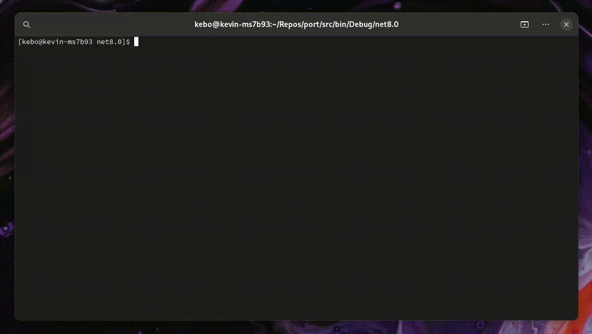

# 🐳 port: run and manage containerized services with ease


[](https://github.com/kevinboss/port/actions/workflows/ci.yaml) 
[](https://github.com/kevinboss/heartbeat) 
[](LICENSE)

Port streamlines the management of Docker images and containers, empowering you to:

- ▶️ **Run containers** effortlessly with simple commands.
- ⏹️ **Stop running containers** seamlessly.
- 📋 **List all containers** to keep track of their status.
- 🗑️ **Remove unwanted containers** to free up resources.
- 🔄 **Reset containers** to their original state for reusability.
- 💾 **Save container states** for future use or backups.

All this without the hassle of memorizing complex Docker CLI commands, even when working with remote Docker engines.



## 📥 Installation

### Scoop

```powershell
scoop bucket add maple 'https://github.com/kevinboss/maple.git'
scoop install port
```

### Winget

```powershell
winget install kevinboss.port
```

### Manual Installation

1. 📂 Download the latest release from the [Releases Page](https://github.com/kevinboss/port/releases).
2. 🛠️ Add the folder to your system PATH:

   ```powershell
   $Env:PATH += "C:\Path\To\Folder"
   ```

## ⚙️ Configuration

Configure Port by creating a `config.yml` file:

```yaml
version: 1.1
dockerEndpoint: unix:///var/run/docker.sock
imageConfigs:
  - identifier: Getting.Started
    imageName: docker/getting-started
    imageTags:
      - latest
      - vscode
    ports:
      - 80:80
    environment:
      - DEBUG=1
```

A default `.port` file will be created in your user profile if you don't manually create one.

## 🧑‍💻 Usage

### Commands

- **▶️ Run an Image**:

  Run a specific tag (base or snapshot) of an image:
  ```powershell
  port run [identifier] -r
  ```

  - `identifier` (optional): If omitted, a prompt will request image selection.
  - `-r` (reset) (optional): Resets the existing container for the specified image, if applicable.

- **⏹️ Stop a Container**:

  Stop a running container:
  ```powershell
  port stop [identifier]
  ```

  - `identifier` (optional): Specifies the container to stop. If omitted, operates on the current container.

- **📋 List Images**:

  Display all images and their tags:
  ```powershell
  port list [identifier]
  ```

  - `identifier` (optional): Limits the listing to images under the given identifier. Without it, all images are listed.

- **🗑️ Remove an Image**:

  Delete a specific image tag (base, snapshot, or untagged):
  ```powershell
  port remove -r [identifier]
  ```

  - `identifier` (optional): If omitted, a prompt will request image selection.
  - `-r` (recursive) (optional): Automatically deletes child images. Without this, an error is raised if the image has dependents.

- **🔄 Reset a Container**:

  Stop, remove, and recreate the container using its original image:
  ```powershell
  port reset [identifier]
  ```

  - `identifier` (optional): If omitted, a prompt will request container selection.

- **💾 Commit a Container**:

  Generate an image from the currently active container:
  ```powershell
  port commit -t [identifier]
  ```

  - `identifier` (optional): If omitted, a prompt will request container selection.
  - `-t` (tag) (optional): Specifies the tag name. Defaults to the current date-time if not provided.
  - `-o` (overwrite) (optional): Re-uses the running image and replaces the existing one.

- **📥 Pull an Image**:

  Download a specific tag (base or snapshot) of an image:
  ```powershell
  port pull [identifier]
  ```

  - `identifier` (optional): If omitted, a prompt will request image selection.

- **🛠️ Prune Images**:

  Remove untagged versions of an image:
  ```powershell
  port prune [identifier]
  ```

  - `identifier` (optional): If omitted, a prompt will request image selection.

## Powershell

To get Unicode support in Powershell, add:

```powershell
[console]::InputEncoding = [console]::OutputEncoding = [System.Text.UTF8Encoding]::new()
```

to your `$profile`.

## 🤝 Contributing

We welcome contributions to improve Port! Please follow the steps below:

1. 🍴 Fork the repository.
2. 🌱 Create a new branch for your feature or bug fix.
3. 💾 Commit your changes.
4. 🔄 Submit a pull request.

## 📄 License

This project is licensed under the [GPL-3.0 License](LICENSE).
