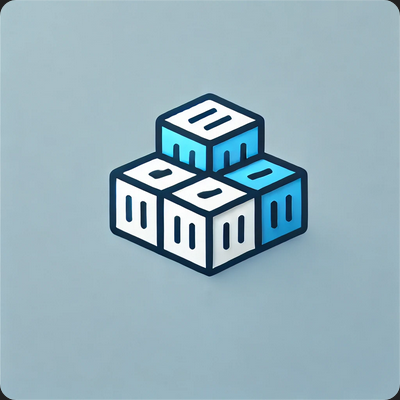
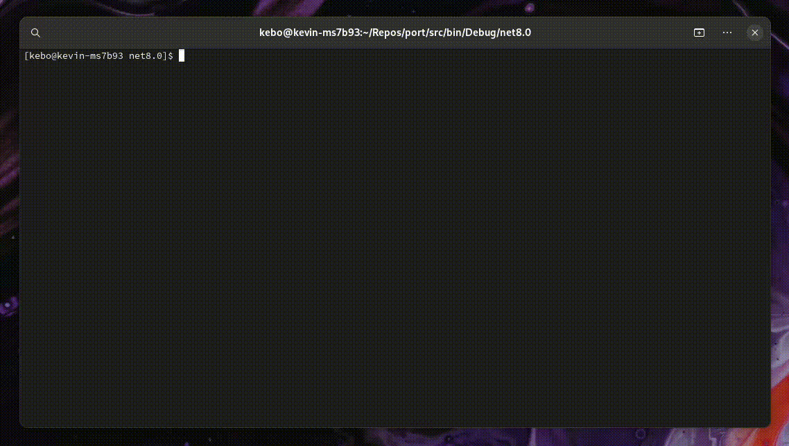

# port



[](https://github.com/kevinboss/port/actions/workflows/ci.yaml)
[](https://github.com/kevinboss/heartbeat)
[](LICENSE)

A small CLI for running and snapshotting Docker containers from a YAML config,
with an MCP server so AI agents can drive the same workflows.



## Install

**Scoop**

```powershell
scoop bucket add maple 'https://github.com/kevinboss/maple.git'
scoop install port
```

**Winget**

```powershell
winget install kevinboss.port
```

**Manual**

Grab a binary from the [releases page](https://github.com/kevinboss/port/releases)
and put it on your `PATH`.

## Configuration

Port reads `~/.port` (or `%USERPROFILE%\.port` on Windows). If the file does
not exist, a default one is written on first run. You can also drop a
`docker-compose.yml` next to where you invoke port and the services in it are
merged in.

```yaml
version: 1.1
dockerEndpoint: unix:///var/run/docker.sock
imageConfigs:
  - identifier: Nginx
    imageName: nginx
    imageTags:
      - alpine
      - alpine-slim
    ports:
      - 8080:80
    environment: []
  - identifier: Alpine
    imageName: alpine
    imageTags:
      - '3.19'
      - latest
    ports: []
    environment: []
```

`identifier` is the human-friendly name port uses everywhere (commands, container
names, tags); `imageName` is the actual Docker image; `imageTags` are the tags
port knows how to launch.

## Commands

`port config` prints the path of the config file. Pass `--open` to open it in
your editor.

`port list [identifier]` shows every configured image, every tag, every
snapshot, and the running container if any. With an identifier, the listing is
restricted to that group.

`port pull <identifier:tag>` fetches the image. Per-layer download progress is
shown live.

`port run <identifier:tag> [-r]` launches a container. Any container holding
the same host port is stopped first. `-r` recreates the container instead of
restarting an existing one. Pulls the image if it isn't local yet.

`port stop <containerName>` stops a running container by its full name (e.g.
`Nginx.alpine`). With no name, you get a picker.

`port reset <containerName>` stops, removes, and recreates a container — useful
to discard mutations made inside it.

`port commit <containerName> [-t tag] [-s] [-o]` snapshots a running container
into a new image. `-t` sets the tag (defaults to a timestamp); `-s` switches
the running container to the new snapshot; `-o` overwrites the source tag.

`port remove <identifier:tag> [-r]` removes the image and any containers using
it. `-r` also removes descendant snapshot images.

`port prune [identifier]` removes dangling (digest-only) images. Restrict to
one identifier with the optional argument.

## MCP server

`port mcp` starts a [Model Context Protocol](https://modelcontextprotocol.io)
server over stdio. AI agents can then drive port the same way you do from the
shell.

The exposed tools mirror the CLI verbs: `run`, `stop`, `reset`, `commit`,
`pull`, `remove`, `prune`, `list`, `config`. A few have stricter inputs than
their CLI siblings — `reset` always requires a container name, `commit`
requires an explicit tag — to remove ambiguity for an agent.

### Claude Code

```bash
claude mcp add port -- port mcp
```

### Claude Desktop

Add to your `claude_desktop_config.json`:

```json
{
  "mcpServers": {
    "port": {
      "command": "port",
      "args": ["mcp"]
    }
  }
}
```

## PowerShell Unicode

To get proper rendering of port's output in PowerShell, add this to your
`$profile`:

```powershell
[console]::InputEncoding = [console]::OutputEncoding = [System.Text.UTF8Encoding]::new()
```

## Contributing

PRs welcome. Fork, branch, commit, open a pull request.

## License

[GPL-3.0](LICENSE)
